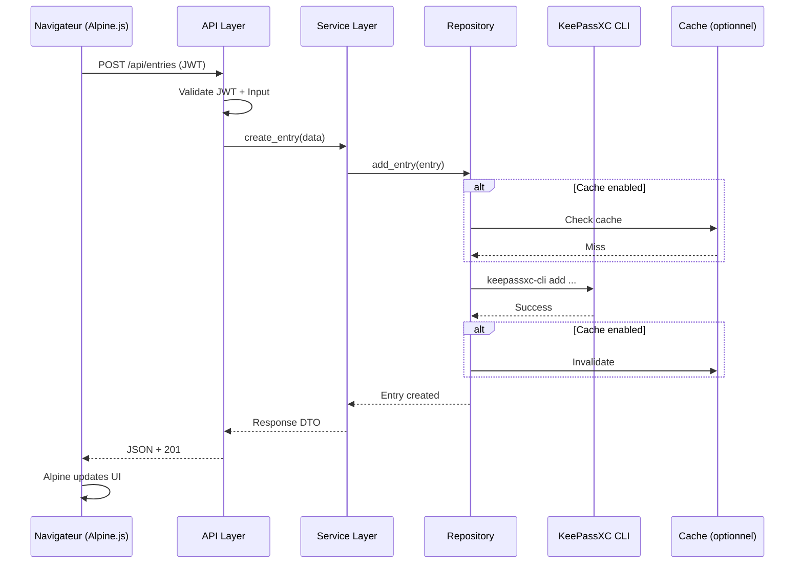

# 🏗️ Architecture KeePassXC Web Manager v2.0

> Refonte complète pour KeePassXC 2.7.10 avec Alpine.js + Tailwind CSS

---

## 📋 Table des matières

1. [Vue d'ensemble](#vue-densemble)
2. [Changements majeurs vs v1.0](#changements-majeurs-vs-v10)
3. [Architecture technique](#architecture-technique)
4. [Structure du projet](#structure-du-projet)
5. [Nouvelles fonctionnalités](#nouvelles-fonctionnalités)
6. [Stack technique](#stack-technique)
7. [Plan de développement](#plan-de-développement)

---

## 🎯 Vue d'ensemble

### Objectifs de la refonte

1. **Interface moderne** : Alpine.js + Tailwind CSS pour une UX fluide
2. **Performance** : Cache intelligent, requêtes optimisées
3. **Nouvelles fonctionnalités KeePassXC 2.7.x** : Notes, tags, recherche avancée
4. **Clean Architecture** : Code maintenable, testable, évolutif
5. **Sécurité renforcée** : Rate limiting, audit logging, validation stricte
6. **Multi-usage** : Personnel, équipe, bases multiples

### Compatibilité

- **KeePassXC CLI** : 2.7.10+
- **Python** : 3.11+
- **Navigateurs** : Chrome/Firefox/Safari dernières versions

---

## 🔄 Changements majeurs vs v1.0

### ✅ Ce qui est conservé

- FastAPI comme backend
- Architecture REST API
- Sessions JWT + chiffrement Fernet
- Gestion CRUD des entrées
- Dashboard avec statistiques
- Mode clair/sombre

### 🆕 Nouveautés

| Fonctionnalité | v1.0 | v2.0 |
|----------------|------|------|
| **Frontend** | Vanilla JS | Alpine.js + Tailwind |
| **Notes** | ❌ Non supporté | ✅ Création/édition |
| **Tags** | ❌ | ✅ Gestion complète |
| **Recherche** | Basique (`ls` + filtrage) | Avancée (`search` CLI) |
| **UUID** | ❌ | ✅ Affichage + copie |
| **Attributs personnalisés** | ❌ | ✅ Support complet |
| **Cache** | ❌ | ✅ Redis optionnel |
| **Tests** | ❌ | ✅ Pytest complet |
| **Multi-bases** | 1 seule | ✅ Gestion multiple |
| **Export** | CLI templates | ✅ + HTML, JSON |
| **TOTP/2FA** | ❌ | ✅ Visualisation |

### 🔧 Améliorations techniques

- **Clean Architecture** : Découplage domaine/infrastructure
- **Repository Pattern** : Abstraction de `keepassxc-cli`
- **Service Layer** : Logique métier isolée
- **DTO/Schemas** : Validation Pydantic v2
- **Async optimisé** : Vraies opérations async (pas de subprocess bloquants)
- **Logging structuré** : JSON logs pour analyse
- **Health checks** : Endpoints de monitoring

---

## 🏛️ Architecture technique

### Principes d'architecture

#### 1. Clean Architecture (Hexagonal)

```
┌─────────────────────────────────────────────────────────┐
│                     PRESENTATION                        │
│  (API Endpoints, WebSockets, Templates)                 │
└────────────────────┬────────────────────────────────────┘
                     │
┌────────────────────▼────────────────────────────────────┐
│                   APPLICATION                           │
│  (Use Cases, Services, Business Logic)                  │
└────────────────────┬────────────────────────────────────┘
                     │
┌────────────────────▼────────────────────────────────────┐
│                     DOMAIN                              │
│  (Entities, Value Objects, Interfaces)                  │
└────────────────────┬────────────────────────────────────┘
                     │
┌────────────────────▼────────────────────────────────────┐
│                 INFRASTRUCTURE                          │
│  (KeePassXC CLI, Cache, Security, External APIs)        │
└─────────────────────────────────────────────────────────┘
```

#### 2. Flux de données



---

## 📁 Structure du projet

```
keepassxc-web-manager/
├── backend/
│   ├── app/
│   │   ├── __init__.py
│   │   ├── main.py                    # Point d'entrée FastAPI
│   │   │
│   │   ├── api/                       # 🔵 PRESENTATION LAYER
│   │   │   ├── __init__.py
│   │   │   ├── dependencies.py        # Dépendances FastAPI
│   │   │   ├── middleware.py          # Middlewares custom
│   │   │   └── v1/                    # API v1
│   │   │       ├── __init__.py
│   │   │       ├── auth.py            # Authentification
│   │   │       ├── entries.py         # CRUD entrées
│   │   │       ├── groups.py          # Gestion groupes
│   │   │       ├── tags.py            # Gestion tags
│   │   │       ├── search.py          # Recherche avancée
│   │   │       ├── database.py        # Info base + db-edit
│   │   │       ├── export.py          # Export multi-formats
│   │   │       └── health.py          # Health checks
│   │   │
│   │   ├── core/                      # 🟢 APPLICATION + DOMAIN LAYER
│   │   │   ├── __init__.py
│   │   │   ├── config.py              # Configuration (Pydantic Settings)
│   │   │   ├── exceptions.py          # Exceptions custom
│   │   │   ├── logging.py             # Configuration logging
│   │   │   │
│   │   │   ├── domain/                # Entités métier
│   │   │   │   ├── __init__.py
│   │   │   │   ├── entry.py           # Entité Entry
│   │   │   │   ├── group.py           # Entité Group
│   │   │   │   ├── database.py        # Entité Database
│   │   │   │   └── session.py         # Entité Session
│   │   │   │
│   │   │   ├── interfaces/            # Interfaces (ports)
│   │   │   │   ├── __init__.py
│   │   │   │   ├── repository.py      # IRepository
│   │   │   │   ├── cache.py           # ICacheService
│   │   │   │   └── security.py        # ISecurityService
│   │   │   │
│   │   │   └── services/              # Use cases / Business Logic
│   │   │       ├── __init__.py
│   │   │       ├── auth_service.py
│   │   │       ├── entry_service.py
│   │   │       ├── search_service.py
│   │   │       ├── export_service.py
│   │   │       └── database_service.py
│   │   │
│   │   ├── infrastructure/            # 🟠 INFRASTRUCTURE LAYER
│   │   │   ├── __init__.py
│   │   │   │
│   │   │   ├── keepassxc/             # Interface KeePassXC
│   │   │   │   ├── __init__.py
│   │   │   │   ├── cli_wrapper.py     # Wrapper CLI
│   │   │   │   ├── command_builder.py # Builder de commandes
│   │   │   │   ├── parser.py          # Parser de sortie CLI
│   │   │   │   └── repository.py      # Implémentation IRepository
│   │   │   │
│   │   │   ├── cache/                 # Système de cache
│   │   │   │   ├── __init__.py
│   │   │   │   ├── memory_cache.py    # Cache en mémoire (default)
│   │   │   │   └── redis_cache.py     # Cache Redis (optionnel)
│   │   │   │
│   │   │   ├── security/              # Sécurité
│   │   │   │   ├── __init__.py
│   │   │   │   ├── jwt.py             # Gestion JWT
│   │   │   │   ├── encryption.py      # Chiffrement Fernet
│   │   │   │   ├── sessions.py        # Gestion sessions
│   │   │   │   ├── rate_limit.py      # Rate limiting
│   │   │   │   └── validators.py      # Validateurs sécurité
│   │   │   │
│   │   │   └── monitoring/            # Monitoring et logs
│   │   │       ├── __init__.py
│   │   │       ├── metrics.py         # Métriques
│   │   │       └── audit.py           # Audit logging
│   │   │
│   │   └── schemas/                   # 📝 SCHEMAS (DTO)
│   │       ├── __init__.py
│   │       ├── auth.py                # Schemas auth
│   │       ├── entry.py               # Schemas entry
│   │       ├── search.py              # Schemas search
│   │       ├── export.py              # Schemas export
│   │       └── common.py              # Schemas communs
│   │
│   ├── tests/                         # 🧪 TESTS
│   │   ├── __init__.py
│   │   ├── conftest.py                # Fixtures pytest
│   │   │
│   │   ├── unit/                      # Tests unitaires
│   │   │   ├── core/
│   │   │   │   └── services/
│   │   │   └── infrastructure/
│   │   │       └── keepassxc/
│   │   │
│   │   ├── integration/               # Tests d'intégration
│   │   │   ├── test_keepassxc_cli.py
│   │   │   └── test_cache.py
│   │   │
│   │   └── e2e/                       # Tests end-to-end
│   │       └── test_api_flows.py
│   │
│   ├── requirements/
│   │   ├── base.txt                   # Dépendances de base
│   │   ├── dev.txt                    # Dépendances dev
│   │   └── prod.txt                   # Dépendances prod
│   │
│   ├── alembic/                       # Migrations (si DB future)
│   │   └── versions/
│   │
│   └── scripts/
│       ├── start.py                   # Script de démarrage
│       └── init_db.py                 # Init (si besoin)
│
├── frontend/
│   ├── src/
│   │   ├── js/
│   │   │   ├── app.js                 # Application Alpine.js
│   │   │   ├── api.js                 # Client API
│   │   │   ├── auth.js                # Gestion auth
│   │   │   ├── stores/                # Stores Alpine
│   │   │   │   ├── entries.js
│   │   │   │   ├── search.js
│   │   │   │   └── ui.js
│   │   │   └── utils/
│   │   │       ├── crypto.js
│   │   │       └── clipboard.js
│   │   │
│   │   └── css/
│   │       └── tailwind.css           # Config Tailwind
│   │
│   ├── templates/                     # Templates Jinja2
│   │   ├── base.html
│   │   ├── login.html
│   │   ├── dashboard.html
│   │   ├── entries/
│   │   │   ├── list.html
│   │   │   ├── detail.html
│   │   │   └── edit.html
│   │   └── components/                # Composants réutilisables
│   │       ├── navbar.html
│   │       ├── sidebar.html
│   │       └── modals.html
│   │
│   └── public/                        # Fichiers statiques
│       ├── favicon.ico
│       └── images/
│
├── docs/                              # 📚 DOCUMENTATION
│   ├── API.md                         # Documentation API
│   ├── ARCHITECTURE.md                # Architecture (ce fichier)
│   ├── DEVELOPMENT.md                 # Guide développement
│   ├── DEPLOYMENT.md                  # Guide déploiement
│   └── SECURITY.md                    # Guide sécurité
│
├── docker/                            # 🐳 DOCKER (Phase finale)
│   ├── Dockerfile
│   ├── docker-compose.yml
│   └── nginx/
│       └── nginx.conf
│
├── scripts/                           # Scripts utilitaires
│   ├── setup.sh
│   ├── test.sh
│   └── lint.sh
│
├── .github/                           # CI/CD (optionnel)
│   └── workflows/
│       └── tests.yml
│
├── .env.example                       # Exemple de configuration
├── .gitignore
├── README.md
├── pyproject.toml                     # Config Python moderne
└── tailwind.config.js                 # Config Tailwind

```

---

## 🚀 Nouvelles fonctionnalités

### 1. Gestion des notes (PRIORITÉ 1)

**Problème actuel** : L'ancien code ne supporte pas les notes (KeePassXC 2.6.2)

**Solution v2.0** :
- Création avec notes via `-n/--notes`
- Édition des notes existantes
- Affichage formaté (Markdown support)
- Recherche dans les notes

**API** :
```python
POST /api/v1/entries
{
  "title": "Mon entrée",
  "username": "user@example.com",
  "password": "secret",
  "url": "https://example.com",
  "notes": "Notes importantes\nMulti-lignes"  # ✅ Nouveau
}
```

### 2. Tags/Étiquettes

**Description** : Organisation par tags

**Fonctionnalités** :
- CRUD sur tags
- Association tags ↔ entrées
- Filtrage par tags
- Tags populaires

**API** :
```python
GET  /api/v1/tags                    # Liste des tags
POST /api/v1/entries/{id}/tags       # Ajouter un tag
GET  /api/v1/entries?tags=work,ssh   # Filtrer par tags
```

### 3. Recherche avancée

**Nouvelle commande CLI** : `keepassxc-cli search`

**Fonctionnalités** :
- Recherche full-text
- Filtres combinés (username, URL, notes, tags)
- Recherche par regex (optionnel)
- Résultats triés par pertinence

**API** :
```python
POST /api/v1/search
{
  "query": "github",
  "filters": {
    "in_fields": ["title", "url", "notes"],
    "tags": ["work"],
    "groups": ["Development"]
  },
  "sort": "relevance",
  "limit": 50
}
```

### 4. Attributs personnalisés

**Description** : Support des champs custom KeePassXC

**CLI** : `show --all-attributes`

**Fonctionnalités** :
- Lecture des attributs custom
- Ajout/édition d'attributs
- Affichage dans l'UI

### 5. UUID et métadonnées

**Fonctionnalités** :
- Affichage de l'UUID d'entrée
- Copie dans presse-papier
- Utilisation pour références

### 6. Export multi-formats

**Formats supportés** :
- HTML (nouveau en 2.7.10)
- JSON (pour backup)
- CSV (pour import dans d'autres outils)
- Templates CLI (conservé de v1)

**API** :
```python
POST /api/v1/export
{
  "format": "html",  # html, json, csv, cli-template
  "filters": { ... },
  "include_passwords": false  # Sécurité
}
```

### 7. Gestion multi-bases

**Description** : Gérer plusieurs bases KeePass simultanément

**Fonctionnalités** :
- Connexion à plusieurs bases
- Switch entre bases
- Sessions multiples
- Dashboard global

**UI** :
- Sélecteur de base dans navbar
- Couleur par base
- Statistiques combinées

### 8. Historique des entrées

**Description** : Visualiser l'historique des modifications

**Fonctionnalités** :
- Liste des versions précédentes
- Comparaison de versions
- Restauration (si supporté par CLI)

### 9. Génération de mots de passe avancée

**Améliorations** :
- Patterns personnalisés
- Dictionnaire de mots (passphrase)
- Prononciation facile
- Force estimée (zxcvbn)

### 10. Analyse de sécurité

**Fonctionnalités** :
- Score de sécurité par entrée
- Détection de mots de passe faibles
- Détection de doublons
- Âge des mots de passe
- Mots de passe compromis (Have I Been Pwned API)

### 11. TOTP/2FA (Lecture seule)

**Description** : Visualisation des codes TOTP (si configurés dans KeePassXC)

**Note** : Lecture seule pour commencer, configuration via GUI KeePassXC

### 12. Dashboard amélioré

**Widgets** :
- Statistiques en temps réel
- Graphiques de sécurité
- Activité récente
- Top tags/groupes
- Alertes sécurité

### 13. Mode PWA (Progressive Web App)

**Fonctionnalités** :
- Installation comme app native
- Mode offline limité
- Notifications
- Thème adaptatif OS

---

## 🛠️ Stack technique

### Backend

| Composant | Technologie | Version | Justification |
|-----------|-------------|---------|---------------|
| **Framework** | FastAPI | 0.110+ | Performance, async, OpenAPI auto |
| **Validation** | Pydantic | 2.x | Validation robuste, Settings |
| **Auth** | python-jose | 3.3+ | JWT standard |
| **Crypto** | cryptography | 42.x | Fernet, primitives crypto |
| **Testing** | pytest | 8.x | Standard Python |
| **Cache** | aiocache | 0.12+ | Cache async (mémoire/Redis) |
| **Logging** | structlog | 24.x | Logs structurés JSON |
| **Rate Limit** | slowapi | 0.1.9 | Rate limiting simple |
| **Server** | uvicorn | 0.29+ | ASGI performant |

### Frontend

| Composant | Technologie | Version | Justification |
|-----------|-------------|---------|---------------|
| **Framework** | Alpine.js | 3.x | Léger, réactif, pas de build |
| **CSS** | Tailwind CSS | 3.x | Utility-first, rapide |
| **Icons** | Heroicons | 2.x | Intégration Tailwind |
| **Charts** | Chart.js | 4.x | Graphiques dashboard |
| **Clipboard** | Clipboard API | Native | Copie sécurisée |
| **Notifications** | Alpine Notify | Plugin | Toasts |

### Outils de développement

- **Linting** : Ruff (remplace Black + Flake8 + isort)
- **Type checking** : mypy
- **Pre-commit** : pre-commit hooks
- **Documentation** : mkdocs + mkdocs-material

### Infrastructure (optionnelle)

- **Cache** : Redis (optionnel, fallback mémoire)
- **Reverse proxy** : Nginx
- **Conteneurisation** : Docker + Docker Compose

---

## 📅 Plan de développement

### Phase 0 : Préparation (1 jour)

**Objectif** : Setup environnement et structure

- [ ] Initialiser la structure de projet
- [ ] Configurer pyproject.toml (Poetry ou pip-tools)
- [ ] Setup pre-commit hooks
- [ ] Configurer Tailwind CSS + Alpine.js
- [ ] Créer .env.example
- [ ] Initialiser tests (conftest.py)

**Livrable** : Projet vide mais structuré

---

### Phase 1 : Core Infrastructure (3-4 jours)

**Objectif** : Fondations solides

#### 1.1 Domain Layer
- [ ] Entités métier (Entry, Group, Database, Session)
- [ ] Interfaces (IRepository, ICacheService, ISecurityService)
- [ ] Exceptions custom

#### 1.2 Infrastructure - KeePassXC
- [ ] CLI Wrapper (subprocess async propre)
- [ ] Command Builder (construction commandes)
- [ ] Parser (parsing sortie CLI avec regex)
- [ ] Repository (implémentation IRepository)
- [ ] Tests unitaires du wrapper

#### 1.3 Infrastructure - Security
- [ ] JWT manager
- [ ] Encryption (Fernet)
- [ ] Session manager (avec nettoyage auto)
- [ ] Validators (chemins, inputs)

#### 1.4 Cache
- [ ] Interface cache
- [ ] Implémentation mémoire
- [ ] Tests

**Livrable** : Infrastructure testée et documentée

---

### Phase 2 : API Core (3-4 jours)

**Objectif** : API fonctionnelle avec fonctionnalités de base

#### 2.1 Authentication
- [ ] Service d'authentification
- [ ] Endpoints login/logout
- [ ] Middleware JWT
- [ ] Tests API auth

#### 2.2 CRUD Entrées (avec notes !)
- [ ] Service entries
- [ ] Endpoints CRUD complets
- [ ] Support des notes (add/edit/show)
- [ ] Tests API entries

#### 2.3 Groupes
- [ ] Service groupes
- [ ] Endpoints liste/navigation
- [ ] Tests

#### 2.4 Database info
- [ ] Service database
- [ ] Endpoints info/stats
- [ ] Tests

**Livrable** : API REST complète et testée

---

### Phase 3 : Recherche et Tags (2-3 jours)

**Objectif** : Fonctionnalités avancées

#### 3.1 Recherche avancée
- [ ] Intégration `keepassxc-cli search`
- [ ] Service de recherche
- [ ] Filtres multiples
- [ ] Endpoint search
- [ ] Tests

#### 3.2 Tags
- [ ] Parsing des tags depuis CLI
- [ ] Service tags
- [ ] Endpoints CRUD tags
- [ ] Filtrage par tags
- [ ] Tests

**Livrable** : Recherche et tags fonctionnels

---

### Phase 4 : Frontend Base (4-5 jours)

**Objectif** : Interface utilisateur moderne

#### 4.1 Setup
- [ ] Templates Jinja2 de base
- [ ] Configuration Tailwind
- [ ] Alpine.js setup
- [ ] Composants de base (navbar, sidebar)

#### 4.2 Authentification
- [ ] Page de login
- [ ] Gestion du token (localStorage)
- [ ] Déconnexion
- [ ] Messages d'erreur

#### 4.3 Dashboard
- [ ] Statistiques en temps réel
- [ ] Widgets
- [ ] Graphiques (Chart.js)

#### 4.4 Gestion des entrées
- [ ] Liste paginée
- [ ] Formulaire de création (avec notes !)
- [ ] Formulaire d'édition
- [ ] Modal de détails
- [ ] Copie mot de passe (clipboard)
- [ ] Confirmation suppression

#### 4.5 Recherche et filtres
- [ ] Barre de recherche
- [ ] Filtres avancés
- [ ] Résultats en temps réel

**Livrable** : Interface complète et utilisable

---

### Phase 5 : Fonctionnalités avancées (3-4 jours)

**Objectif** : Fonctionnalités différenciantes

#### 5.1 Export
- [ ] Service export
- [ ] Export HTML
- [ ] Export JSON
- [ ] Export CSV
- [ ] Templates CLI (migration v1)
- [ ] Endpoint export

#### 5.2 Multi-bases
- [ ] Gestion sessions multiples
- [ ] Switch entre bases
- [ ] UI sélection de base

#### 5.3 Analyse de sécurité
- [ ] Score par entrée
- [ ] Détection doublons
- [ ] Mots de passe faibles
- [ ] Âge des mots de passe
- [ ] Dashboard sécurité

#### 5.4 Attributs personnalisés
- [ ] Lecture attributs custom
- [ ] Affichage dans UI
- [ ] Édition (si possible)

**Livrable** : Fonctionnalités avancées opérationnelles

---

### Phase 6 : Polissage et UX (2-3 jours)

**Objectif** : Expérience utilisateur excellente

#### 6.1 UI/UX
- [ ] Animations Tailwind
- [ ] Loading states
- [ ] Toasts/notifications
- [ ] Messages d'erreur clairs
- [ ] Shortcuts clavier
- [ ] Mode sombre/clair
- [ ] Responsive complet

#### 6.2 Performance
- [ ] Pagination intelligente
- [ ] Lazy loading
- [ ] Debounce recherche
- [ ] Cache browser

#### 6.3 Accessibilité
- [ ] ARIA labels
- [ ] Navigation clavier
- [ ] Contraste couleurs
- [ ] Screen readers

**Livrable** : Application polie et accessible

---

### Phase 7 : Sécurité renforcée (2 jours)

**Objectif** : Sécurité production-ready

- [ ] Rate limiting sur tous les endpoints
- [ ] Audit logging (qui fait quoi quand)
- [ ] Validation stricte inputs
- [ ] CORS configuré
- [ ] CSP headers
- [ ] Tests de sécurité
- [ ] Documentation sécurité

**Livrable** : Application sécurisée

---

### Phase 8 : Tests et Documentation (2-3 jours)

**Objectif** : Qualité et maintenabilité

#### 8.1 Tests
- [ ] Tests unitaires (80%+ couverture)
- [ ] Tests d'intégration
- [ ] Tests E2E (playwright ou selenium)
- [ ] Tests de sécurité

#### 8.2 Documentation
- [ ] README complet
- [ ] API documentation (OpenAPI enrichie)
- [ ] Guide développement
- [ ] Guide déploiement
- [ ] Guide sécurité
- [ ] Changelog

**Livrable** : Application testée et documentée

---

### Phase 9 : Docker et déploiement (2 jours)

**Objectif** : Déploiement facile

- [ ] Dockerfile optimisé
- [ ] docker-compose.yml
- [ ] Configuration Nginx
- [ ] Variables d'environnement
- [ ] Scripts de démarrage
- [ ] Health checks
- [ ] Documentation déploiement

**Livrable** : Application conteneurisée

---

### Phase 10 : Bonus (optionnel, selon temps)

- [ ] PWA (manifest + service worker)
- [ ] Notifications push
- [ ] Mode offline
- [ ] Import depuis autres password managers
- [ ] API publique avec clés d'API
- [ ] Webhooks
- [ ] Integration Continue (GitHub Actions)

---

## 📊 Estimation totale

| Phase | Durée estimée | Priorité |
|-------|---------------|----------|
| Phase 0 | 1 jour | 🔴 Critique |
| Phase 1 | 3-4 jours | 🔴 Critique |
| Phase 2 | 3-4 jours | 🔴 Critique |
| Phase 3 | 2-3 jours | 🟠 Haute |
| Phase 4 | 4-5 jours | 🔴 Critique |
| Phase 5 | 3-4 jours | 🟠 Haute |
| Phase 6 | 2-3 jours | 🟡 Moyenne |
| Phase 7 | 2 jours | 🟠 Haute |
| Phase 8 | 2-3 jours | 🟡 Moyenne |
| Phase 9 | 2 jours | 🟢 Basse |
| **TOTAL** | **24-33 jours** | |

**Note** : Estimation pour 1 développeur à temps plein. Peut être réduit avec plusieurs développeurs ou en priorisant différemment.

---

## 🔐 Considérations de sécurité

### Priorités sécurité

1. **Jamais de mots de passe en clair dans les logs**
2. **Chiffrement systématique en mémoire** (Fernet)
3. **Validation stricte de tous les inputs**
4. **Rate limiting agressif** (5 tentatives login/minute)
5. **Sessions courtes** (30 min par défaut)
6. **Audit logging** de toutes les opérations sensibles
7. **HTTPS obligatoire en production**
8. **CSP headers** pour XSS protection
9. **Pas de stockage persistant des credentials**
10. **Tests de sécurité automatisés**

### Threat Model

| Menace | Mitigation |
|--------|------------|
| XSS | CSP, sanitisation inputs, Alpine.js auto-escape |
| CSRF | Tokens JWT, SameSite cookies |
| Injection | Validation Pydantic, pas de shell direct |
| Path Traversal | Validation chemins stricte |
| Brute force | Rate limiting, lockout temporaire |
| Session hijacking | JWT court, HTTPS only |
| DoS | Rate limiting, timeout courts |

---

## 🎨 Choix techniques justifiés

### Pourquoi Alpine.js ?

✅ **Pour** :
- Léger (15KB)
- Pas de build nécessaire
- Syntaxe simple (comme Vue.js)
- Parfait pour enrichir du HTML
- Bonne DX (Developer Experience)

❌ **Contre** :
- Moins d'outils qu'un gros framework
- Communauté plus petite
- Pas idéal pour SPA complexe (mais pas notre cas)

**Verdict** : Parfait pour notre use case (interface d'administration)

### Pourquoi Tailwind CSS ?

✅ **Pour** :
- Développement rapide
- Cohérence design garantie
- Pas de CSS custom à maintenir
- Responsive facile
- Mode sombre intégré

❌ **Contre** :
- HTML plus verbeux
- Courbe d'apprentissage
- Taille initiale (mitigée par PurgeCSS)

**Verdict** : Idéal pour UI moderne sans designer dédié

### Pourquoi Clean Architecture ?

✅ **Pour** :
- Testabilité maximale
- Découplage infrastructure/métier
- Évolutivité
- Maintenabilité long terme

❌ **Contre** :
- Plus de code initial
- Complexité apparente

**Verdict** : Essentiel pour un projet sérieux et évolutif

---

## 🤔 Questions ouvertes

1. **Cache Redis** : L'ajouter en Phase 1 ou plus tard ?
   - Recommandation : Plus tard (optionnel), commencer avec cache mémoire

2. **Base de données SQL** : Pour stocker métadonnées (historique, audit) ?
   - Recommandation : Pas en v2.0, tout dans KeePassXC pour simplicité

3. **WebSockets** : Pour updates temps réel ?
   - Recommandation : Pas nécessaire, polling suffisant

4. **Internationalisation** : FR/EN ?
   - Recommandation : Phase 10 (bonus)

---

## 📝 Notes de migration depuis v1.0

### Changements breaking

- [ ] Structure de projet complètement différente
- [ ] API v1 (nouvelle version) : `/api/v1/...`
- [ ] Nouveaux schemas Pydantic v2
- [ ] Frontend complètement réécrit

### Migration données

- [ ] Pas de migration nécessaire (KeePassXC format standard)
- [ ] Sessions existantes invalidées
- [ ] Configuration à adapter

### Rétrocompatibilité

- [ ] Garder l'export CLI templates (fonctionnalité unique)
- [ ] Conserver la logique de changement en masse

---

## 📚 Ressources et références

- [KeePassXC CLI Documentation](https://keepassxc.org/docs/KeePassXC_UserGuide.html#_command_line_interface)
- [FastAPI Best Practices](https://fastapi.tiangolo.com/tutorial/)
- [Alpine.js Documentation](https://alpinejs.dev/)
- [Tailwind CSS Documentation](https://tailwindcss.com/)
- [Clean Architecture in Python](https://www.cosmicpython.com/)

---

**Date de création** : 2025-11-05
**Version** : 2.0.0-alpha
**Auteur** : Architecture conçue pour refonte KeePassXC Web Manager
